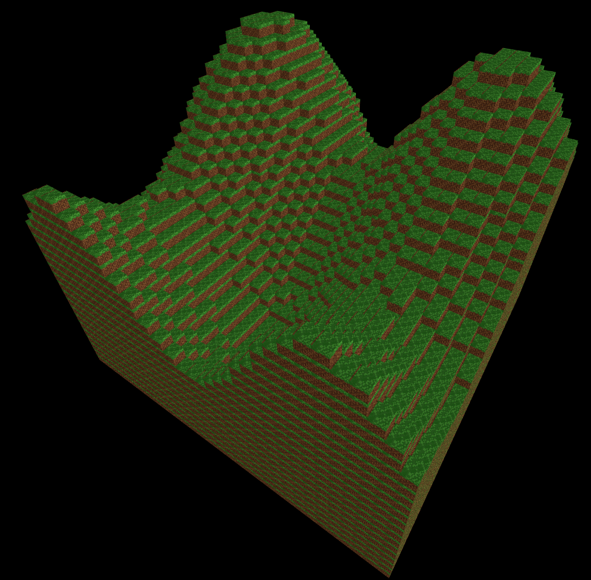

# mc-voxel

(try to) re-make minecraft basically in a day

followed this tutorial: https://threejs.org/manual/#en/voxel-geometry

went off-script to use the minecraft grass/dirt texture instead: 



## Setup

Install node.js then three.js and Vite:

```
# three.js
npm install --save three

# vite
npm install --save-dev vite
```

Run:

```
npx vite 
```

Browser URL: `http://localhost:5173`